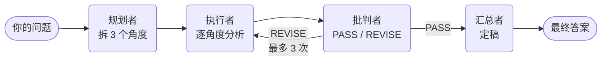

# multi-agent-assistant

> 多 Agent 协作智囊团 —— 输入一个开放问题,四角色协作产出带「批判 → 回炉重做」自我改进的高质量答案。



## 核心特性

- **多角色协作**:规划 / 执行 / 批判 / 汇总 四个 Agent 分工,同一模型戴不同"角色提示词"。
- **自我改进循环**:批判者不满意 → 把分析打回执行者,带着意见重做。
- **安全阀**:重做有次数上限(最多 3 次),避免无限循环烧 token。
- **提示词外置**:角色人设写在 `config/prompts.yaml`,改人设不动代码。

## 技术栈

[LangGraph](https://github.com/langchain-ai/langgraph) · DeepSeek API(OpenAI 兼容) · Typer · PyYAML

## 快速开始

```bash
# 1. 装依赖
python -m venv .venv
.venv\Scripts\pip install -r requirements.txt   # Windows
# macOS/Linux: source .venv/bin/activate && pip install -r requirements.txt

# 2. 配置密钥:复制 .env.example 为 .env,填入自己的 key
#    DEEPSEEK_API_KEY=sk-xxxx

# 3. 跑
python main.py "现在学习 agent 应用开发的优劣"
```

## 设计笔记

- **「多 Agent」的本质** = 角色分工 + 通过共享状态(State)通信 + 调度,与多智能体系统思想一致。
- **条件边**(conditional edge)是「单向流水线」升级为「会自我改进的系统」的关键。
- **任何带循环的 Agent 都必须有次数上限**,否则会死循环。

## 后续规划

- [ ] 给执行者接入联网搜索工具(从"纯 LLM 嘴替"升级为能调工具的真 Agent)
- [ ] 加 Web 界面(Streamlit / Gradio)

---

*个人学习项目。*
